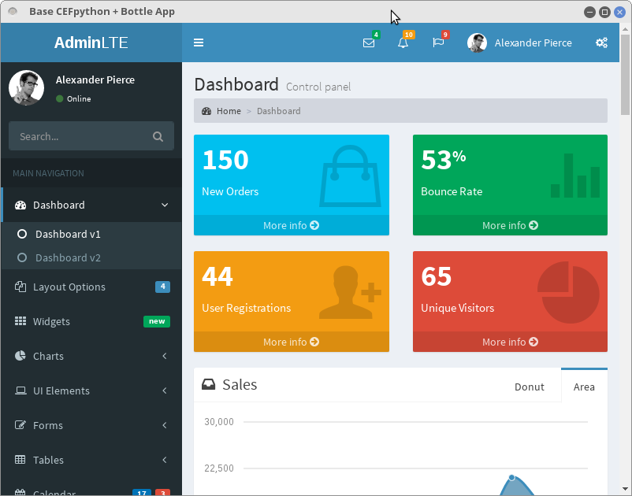

# cefpy-bottle-app

A basic skeleton for CEFPython, Bottle, with Bootstrap 3 and FontAwesome, and more app!




This app is based on different GitHub projects: 

- [cefpython](https://github.com/cztomczak/cefpython): Chromium Embedded Framework bindings for Python.
- [bottlepy](https://github.com/bottlepy/bottle): Bottle is a simple Python framework for web app development.
- [AdminLTE](https://github.com/almasaeed2010/AdminLTE): AdminLTE is a Bootstrap, FrontAwesome, etc based dashboard template.
- [CefBottleDesktop](https://github.com/eristoddle/CefBottleDesktop): a 4-years-old similar project. 

### Instalation

Ensure to install the dependencies in Python 2 (due to cefpython):

```
# apt-get install python-tk
# pip install cefpython3 bottle
```


Fork the repository:  

```
$ git clone https://github.com/isman7/cefpy-bottle-app
```

### Usage

Running directly the `main.py` file gives a launched app in localhost port 8080:

```
$ python main.py
```

The code also provides 4 commands to change host, port and debug mode (with website bar):

```
usage: main.py [-h] [-H H] [-p P] [--debug] [--no-debug]

optional arguments:
  -h, --help  show this help message and exit
  -H H        Host. I. e. 'localhost'
  -p P        Port. I. e. '8080'
  --debug
  --no-debug
```

### TODO list:

- Python 3 compatibility (limitations in tk and cefpython)
- Port more AdminLTE pages to Bottle views (test all plugins...)
- Better integration with AdminLTE features from Python (get an "API" with bottle template parsing)
- Better packaging structure
- Windows? Mac?

